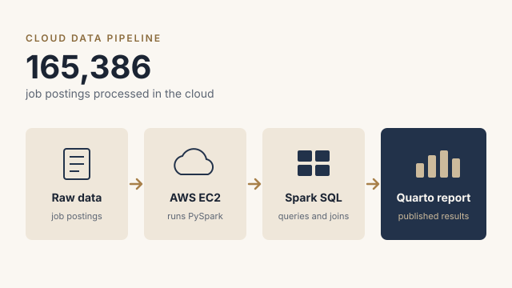
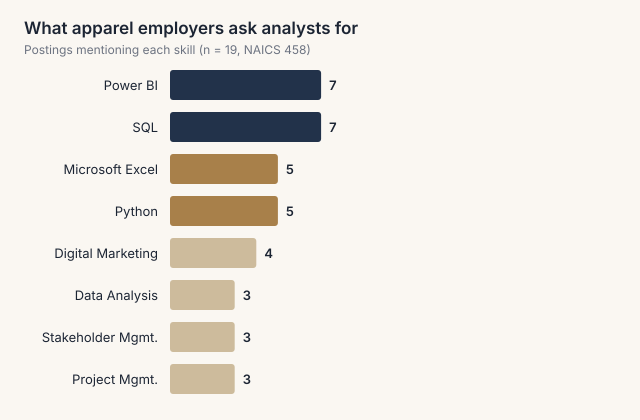
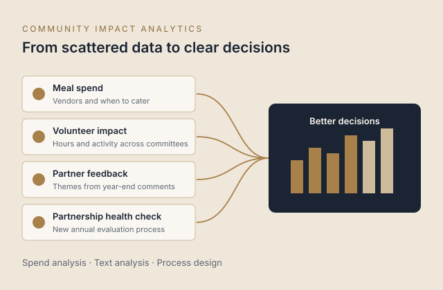

```{=html}
<section class="page-head">
  <div class="wrap">
    <div class="eyebrow">Selected work</div>
    <h1 class="display">Projects</h1>
    <p class="lede narrow">Selected analytics projects from my graduate studies and community work.</p>
    <nav class="jump">
      <a href="#job-market">Job Market Analysis</a>
      <a href="#fashion-apparel">Fashion &amp; Apparel</a>
      <a href="#community-impact">Community Impact</a>
      <a href="#tco">TCO Calculator</a>
    </nav>
  </div>
</section>

<div class="wrap">
  <article class="project" id="job-market">
    <div class="project-media">
      
    </div>
    <div>
      <div class="num">01 &nbsp;/&nbsp; BIG DATA &amp; CLOUD ANALYTICS</div>
      <h2 class="display">Job Market Analysis</h2>
      <div class="meta">AD 688 &middot; Fall 2026</div>
      <p><strong>Context:</strong> Individual assignment for AD 688 Big Data &amp; Cloud Analytics, analyzing a large dataset of job postings from BU's MET Career Match data in a cloud environment on AWS.</p>
      <p class="wid"><strong>What I did:</strong></p>
      <ul>
        <li>Loaded the partitioned Parquet dataset into Spark on an AWS EC2 instance</li>
        <li>Designed a relational model of four linked tables (job postings, companies, industries, locations) with primary and foreign keys</li>
        <li>Wrote Spark SQL joins and aggregations to compare median tech salaries by occupation, rank top remote employers in California, track monthly posting trends, and compare pay across 12 major U.S. metros</li>
        <li>Visualized results with Plotly and Seaborn and published a Quarto report through GitHub</li>
      </ul>
      <ul class="chips"><li>AWS EC2</li><li>PySpark</li><li>Spark SQL</li><li>Data modeling</li><li>Plotly</li><li>Seaborn</li><li>Quarto</li></ul>
    </div>
  </article>

  <article class="project" id="fashion-apparel">
    <div class="project-media">
      
    </div>
    <div>
      <div class="num">02 &nbsp;/&nbsp; TEAM PROJECT <span class="status">In progress</span></div>
      <h2 class="display">Fashion &amp; Apparel Career Evaluation</h2>
      <div class="meta">AD 688 &middot; Group 7 &middot; Team of 4</div>
      <p><strong>Context:</strong> Team project for AD 688 evaluating business and data analyst roles at apparel and fashion employers (NAICS 458) and comparing employer skill requirements with our team's skills.</p>
      <p class="wid"><strong>What I did:</strong></p>
      <ul>
        <li>Led research and built the filtered industry dataset the team uses for analysis</li>
        <li>Cleaned and standardized core variables: salary, experience, location, and work arrangement</li>
        <li>Early finding: <strong>Power BI and SQL</strong> are the most requested skills, each appearing in 7 of 19 postings</li>
      </ul>
      <ul class="chips"><li>Python</li><li>pandas</li><li>Plotly</li><li>Quarto</li><li>GitHub</li></ul>
      <a class="btn-ed solid" href="https://zechnschweitzer.github.io/ad688-fashion-apparel-evaluation-group7/" target="_blank" rel="noopener">View project site</a>
    </div>
  </article>

  <article class="project" id="community-impact">
    <div class="project-media">
      
    </div>
    <div>
      <div class="num">03 &nbsp;/&nbsp; LEADERSHIP</div>
      <h2 class="display">Community Impact Analytics</h2>
      <div class="meta">New York Junior League &middot; Community Senior Council Head</div>
      <p><strong>Context:</strong> Analytics I lead as Community Senior Council Head at the New York Junior League to inform decisions about spending, volunteers, and community partnerships.</p>
      <p class="wid"><strong>What I did:</strong></p>
      <ul>
        <li><strong>Meal spend:</strong> analyzed meal purchases and recommended where to order from and when catering makes sense</li>
        <li><strong>Volunteer impact:</strong> analyzed volunteer hours and activity to give leaders a clearer view of impact</li>
        <li><strong>Partner feedback:</strong> analyzed community partners' end-of-year feedback and comments to surface themes</li>
        <li><strong>Partnership health check:</strong> designed a new annual process for committees to evaluate the health of each community partnership, and for the League to assess committee health and synergies</li>
      </ul>
      <ul class="chips"><li>Spend analysis</li><li>Text analysis</li><li>Process design</li><li>Stakeholder alignment</li></ul>
    </div>
  </article>
</div>

<section class="section alt" id="tco">
  <div class="wrap">
    <div class="eyebrow">04 &nbsp;/&nbsp; Interactive tool</div>
    <h2 class="section-title display">Procurement Total Cost of Ownership Calculator</h2>
    <p class="narrow"><strong>Context:</strong> When choosing a supplier, the lowest price per unit isn't always the least expensive option. Total cost of ownership (TCO) measures what a supplier really costs over the full contract:</p>
    <div class="tco-eq">TCO = Purchase price + Shipping + Import duties + Quality cost + One-time setup cost &minus; Payment terms credit</div>
    <p class="narrow">Enter two suppliers' details below to see which one actually costs less. Results update as you type.</p>

    <div class="tco">
      <div class="tco-shared">
        <label>Annual volume (units)<input type="number" id="t-vol" value="100000" min="0" step="1000"></label>
        <label>Contract term (years)<input type="number" id="t-yrs" value="3" min="1" max="10" step="1"></label>
        <label>Cost of capital (%)<input type="number" id="t-coc" value="8" min="0" max="30" step="0.5"></label>
      </div>

      <div class="tco-grid">
        <div class="tco-sup" data-s="a">
          <h3>Supplier A</h3>
          <label>Unit price ($)<input type="number" data-f="price" value="10.00" min="0" step="0.05"></label>
          <label>Shipping per unit ($)<input type="number" data-f="freight" value="1.20" min="0" step="0.05"></label>
          <label>Import duties (%)<input type="number" data-f="duty" value="7.5" min="0" step="0.5"></label>
          <label>Defect rate (%)<input type="number" data-f="defect" value="3" min="0" max="100" step="0.5"></label>
          <label>Payment terms (days)<input type="number" data-f="terms" value="30" min="0" step="15"></label>
          <label>One-time setup cost ($)<input type="number" data-f="onboard" value="0" min="0" step="1000"></label>
        </div>
        <div class="tco-sup" data-s="b">
          <h3>Supplier B</h3>
          <label>Unit price ($)<input type="number" data-f="price" value="10.60" min="0" step="0.05"></label>
          <label>Shipping per unit ($)<input type="number" data-f="freight" value="0.40" min="0" step="0.05"></label>
          <label>Import duties (%)<input type="number" data-f="duty" value="0" min="0" step="0.5"></label>
          <label>Defect rate (%)<input type="number" data-f="defect" value="0.5" min="0" max="100" step="0.5"></label>
          <label>Payment terms (days)<input type="number" data-f="terms" value="60" min="0" step="15"></label>
          <label>One-time setup cost ($)<input type="number" data-f="onboard" value="15000" min="0" step="1000"></label>
        </div>
      </div>

      <div class="tco-out" aria-live="polite">
        <div class="tco-verdict" id="t-verdict"></div>
        <div class="tco-bars" id="t-bars"></div>
        <div class="tco-legend">
          <span><i style="background:#8FA8C8"></i>Purchase price</span>
          <span><i style="background:var(--camel)"></i>Shipping</span>
          <span><i style="background:#E8E1D3"></i>Import duties</span>
          <span><i style="background:#D9534F"></i>Quality cost</span>
          <span><i style="background:var(--sand)"></i>One-time setup cost</span>
        </div>
        <p class="tco-note"><strong>How it's calculated:</strong> Quality cost is the cost of replacing defective units. Payment terms credit is the value of keeping cash in the business longer when a supplier gives you more time to pay. It is calculated using your cost of capital. Sample values are shown; enter your own to compare.</p>
      </div>
    </div>
  </div>
</section>

<style>
.jump { display: flex; flex-wrap: wrap; gap: .5rem; margin-top: 1.25rem; }
.jump a { font-size: .85rem; padding: .4rem .9rem; border: 1px solid var(--sand); background: #fff; color: var(--ink); text-decoration: none; transition: border-color .2s, color .2s; }
.jump a:hover { border-color: var(--camel); color: var(--camel); }
.project, #tco { scroll-margin-top: 90px; }
.tco { margin-top: 1.75rem; }
.tco-eq { display: inline-block; margin: .25rem 0 1.25rem; padding: .9rem 1.25rem; background: #fff; border-left: 3px solid var(--camel); font-weight: 600; color: var(--ink); line-height: 1.5; }
.tco label { display: block; font-size: .78rem; font-weight: 600; color: var(--muted); margin-bottom: .8rem; }
.tco input { display: block; width: 100%; margin-top: .3rem; padding: .55rem .7rem; border: 1px solid var(--sand); background: #fff; font: inherit; font-size: 1rem; color: var(--ink); border-radius: 0; }
.tco input:focus { outline: 2px solid var(--camel); outline-offset: -1px; }
.tco-shared { display: grid; grid-template-columns: repeat(3, 1fr); gap: 1rem; background: #fff; padding: 1.25rem 1.5rem .5rem; border-top: 3px solid var(--navy); }
.tco-grid { display: grid; grid-template-columns: 1fr 1fr; gap: 1rem; margin-top: 1rem; }
.tco-sup { background: #fff; padding: 1.25rem 1.5rem .5rem; border-top: 3px solid var(--camel); display: grid; grid-template-columns: 1fr 1fr; gap: 0 1rem; }
.tco-sup h3 { grid-column: 1 / -1; font-size: 1.5rem; margin: 0 0 .8rem; }
.tco-out { background: var(--ink); color: var(--ivory); padding: 1.75rem; margin-top: 1rem; }
.tco-verdict { font-family: var(--serif); font-size: 1.6rem; line-height: 1.3; margin-bottom: 1.25rem; }
.tco-verdict b { color: var(--camel); }
.tco-row { display: grid; grid-template-columns: 110px 1fr 200px; gap: 1rem; align-items: center; margin-bottom: .8rem; }
.tco-row .nm { font-weight: 600; }
.tco-row .tot { text-align: right; font-variant-numeric: tabular-nums; }
.tco-row .tot small { display: block; color: var(--sand); font-size: .75rem; }
.tco-track { display: flex; height: 26px; background: rgba(255,255,255,.08); }
.tco-track span { display: block; height: 100%; transition: width .4s ease; }
.tco-legend { display: flex; flex-wrap: wrap; gap: .4rem 1.2rem; font-size: .78rem; color: var(--sand); margin-top: .75rem; }
.tco-legend i { display: inline-block; width: 10px; height: 10px; margin-right: .35rem; vertical-align: middle; }
.tco-note { font-size: .78rem; color: var(--sand); margin: 1rem 0 0; }
@media (max-width: 900px) {
  .tco-shared, .tco-grid { grid-template-columns: 1fr; }
  .tco-row { grid-template-columns: 1fr; gap: .3rem; }
  .tco-row .tot { text-align: left; }
}
@media (max-width: 480px) { .tco-sup { grid-template-columns: 1fr; } }
</style>

<script>
(function () {
  var colors = ["#8FA8C8", "var(--camel)", "#E8E1D3", "#D9534F", "var(--sand)"];
  function num(el) { var v = parseFloat(el.value); return isNaN(v) || v < 0 ? 0 : v; }
  function money(v) { return "$" + Math.round(v).toLocaleString("en-US"); }
  function calc(box, vol, yrs, coc) {
    var g = function (f) { return num(box.querySelector('[data-f="' + f + '"]')); };
    var price = g("price"), freight = g("freight"), duty = g("duty") / 100,
        defect = Math.min(g("defect"), 100) / 100, terms = g("terms"), onboard = g("onboard");
    var purchase = price * vol * yrs;
    var fr = freight * vol * yrs;
    var du = price * duty * vol * yrs;
    var quality = defect * (price * (1 + duty) + freight) * vol * yrs;
    var benefit = purchase * coc * terms / 365;
    var parts = [purchase, fr, du, quality, onboard];
    var total = parts.reduce(function (a, b) { return a + b; }, 0) - benefit;
    return { parts: parts, benefit: benefit, total: total, perUnit: vol * yrs > 0 ? total / (vol * yrs) : 0 };
  }
  function render() {
    var vol = num(document.getElementById("t-vol")),
        yrs = Math.max(1, num(document.getElementById("t-yrs"))),
        coc = num(document.getElementById("t-coc")) / 100;
    var a = calc(document.querySelector('.tco-sup[data-s="a"]'), vol, yrs, coc);
    var b = calc(document.querySelector('.tco-sup[data-s="b"]'), vol, yrs, coc);
    var max = Math.max(a.parts.reduce(function (x, y) { return x + y; }, 0), b.parts.reduce(function (x, y) { return x + y; }, 0)) || 1;
    function row(name, r) {
      var segs = r.parts.map(function (p, i) { return '<span style="width:' + (p / max * 100) + '%;background:' + colors[i] + '"></span>'; }).join("");
      return '<div class="tco-row"><div class="nm">' + name + '</div><div class="tco-track">' + segs + '</div>' +
        '<div class="tot">' + money(r.total) + '<small>$' + r.perUnit.toFixed(2) + ' per unit<br>Payment terms credit ' + money(r.benefit) + '</small></div></div>';
    }
    document.getElementById("t-bars").innerHTML = row("Supplier A", a) + row("Supplier B", b);
    var v = document.getElementById("t-verdict");
    var diff = Math.abs(a.total - b.total);
    if (diff < 1) { v.innerHTML = "Both suppliers cost the same over " + yrs + " year" + (yrs > 1 ? "s" : "") + "."; return; }
    var win = a.total < b.total ? "A" : "B", lose = win === "A" ? "B" : "A";
    var pa = num(document.querySelector('.tco-sup[data-s="a"] [data-f="price"]')),
        pb = num(document.querySelector('.tco-sup[data-s="b"] [data-f="price"]'));
    var cheaperPrice = pa < pb ? "A" : (pb < pa ? "B" : null);
    var twist = cheaperPrice && cheaperPrice !== win ? " despite a higher unit price" : "";
    v.innerHTML = "Supplier " + win + " saves <b>" + money(diff) + "</b> over " + yrs + " year" + (yrs > 1 ? "s" : "") + twist + ".";
  }
  document.querySelectorAll(".tco input").forEach(function (el) { el.addEventListener("input", render); });
  render();
})();
</script>


```
