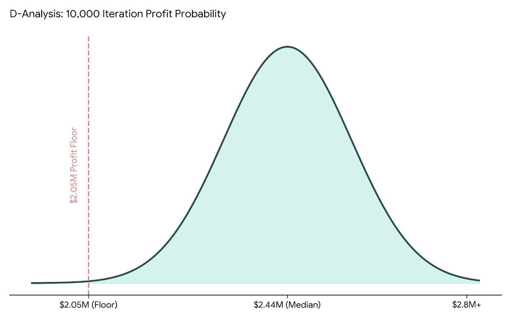
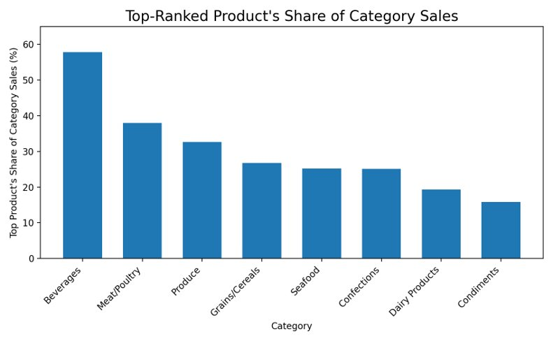
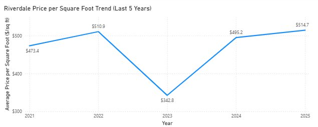
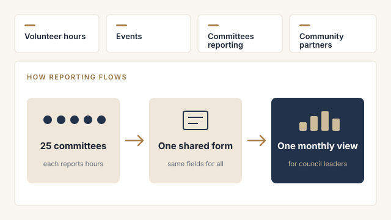

```{=html}
<section class="page-head">
  <div class="wrap">
    <div class="eyebrow">Selected work</div>
    <h1 class="display">Projects</h1>
    <p class="lede">From my graduate studies, community leadership and work in procurement.</p>
  </div>
</section>

<div class="wrap">
  <div class="pgrid">
    <article class="pcard" id="bucka-brew">
      <div class="pcard-img"></div>
      <div class="pcard-body">
        <div class="num">01 &nbsp;/&nbsp; DECISION ANALYSIS</div>
        <h2 class="display">Bucka-Brew Investment Analysis</h2>
        <div class="meta">AD 715 &middot; Spring 2026 &middot; Team project</div>
        <p class="pcard-key">98% chance of at least $2.05M in profit over three years</p>
        <ul class="chips"><li>Financial modeling</li><li>Monte Carlo simulation</li><li>What-if analysis</li><li>Correlation analysis</li></ul>
        <details>
          <summary>Details</summary>
          <p><strong>Context:</strong> A restaurant on Rainey Street in Austin asked whether to invest $175,000 in its own microbrewery.</p>
          <p class="wid"><strong>What I did:</strong></p>
          <ul>
            <li>Built a 36-month financial model covering pricing, production and costs.</li>
            <li>Compared buying and renting brewing tanks. Buying 10 tanks saved about $24K.</li>
            <li>Ran 10,000 simulations to stress-test profit against changing demand.</li>
          </ul>
          <p class="wid"><strong>Results:</strong></p>
          <ul>
            <li>Recommended the investment.</li>
            <li>It pays back in 9 months.</li>
            <li>There's a 98% chance of at least $2.05M in profit over three years.</li>
          </ul>
          <p><strong>What I learned:</strong> A single forecast hides risk. Simulation turns it into a range you can plan around.</p>
        </details>
      </div>
    </article>
    <article class="pcard" id="northwind">
      <div class="pcard-img"></div>
      <div class="pcard-body">
        <div class="num">02 &nbsp;/&nbsp; SQL &amp; PYTHON</div>
        <h2 class="display">Northwind Traders Sales Analysis</h2>
        <div class="meta">AD 599 &middot; Summer 2026 &middot; Team project</div>
        <p class="pcard-key">One product drives 57.8% of Beverages revenue</p>
        <ul class="chips"><li>SQL</li><li>Window functions</li><li>Python</li><li>pandas</li><li>SQLite</li></ul>
        <details>
          <summary>Details</summary>
          <p><strong>Context:</strong> Our team analyzed a sales database for a fictional food distributor to find what drives revenue.</p>
          <p class="wid"><strong>What I did:</strong></p>
          <ul>
            <li>Owned the product category analysis.</li>
            <li>Ranked products within each category using SQL window functions, then ran the queries in Python.</li>
            <li>Measured how much of each category's revenue comes from its top product.</li>
          </ul>
          <p class="wid"><strong>Results:</strong></p>
          <ul>
            <li>One product drives 57.8% of Beverages revenue.</li>
            <li>Condiments is the most balanced category at 15.8%.</li>
            <li>Categories that depend on one product carry more supply risk.</li>
          </ul>
          <p><strong>What I learned:</strong> Sales data can reveal supply risk, not just revenue.</p>
        </details>
      </div>
    </article>
    <article class="pcard" id="riverdale">
      <div class="pcard-img"></div>
      <div class="pcard-body">
        <div class="num">03 &nbsp;/&nbsp; BUSINESS ANALYTICS</div>
        <h2 class="display">Riverdale Market Entry Strategy</h2>
        <div class="meta">AD 571 &middot; Spring 2026 &middot; Individual project</div>
        <p class="pcard-key">Recommended a lean entry with up to $773K in upside and a $63K profit floor</p>
        <ul class="chips"><li>Power BI</li><li>R</li><li>Clustering</li><li>Forecasting</li><li>Optimization</li></ul>
        <details>
          <summary>Details</summary>
          <p><strong>Context:</strong> A five-part analysis of whether a real estate firm should expand into Riverdale in the Bronx.</p>
          <p class="wid"><strong>What I did:</strong></p>
          <ul>
            <li>Found prices at a five-year high of $514.70 per square foot.</li>
            <li>Found prices swing widely and few homes sit in the middle of the market.</li>
            <li>Showed that home size drives price more than age or season.</li>
            <li>Built an optimization model to set the commission rate and staffing.</li>
          </ul>
          <p class="wid"><strong>Results:</strong></p>
          <ul>
            <li>Recommended entering lean with no new hires.</li>
            <li>Even in a downturn, profit stays above $63K.</li>
            <li>The upside is up to $773K.</li>
          </ul>
          <p><strong>What I learned:</strong> My recommendation changed as the analysis got deeper. Early numbers said go now. Risk modeling said go lean.</p>
        </details>
      </div>
    </article>
    <article class="pcard" id="spark-aws">
      <div class="pcard-img"></div>
      <div class="pcard-body">
        <div class="num">04 &nbsp;/&nbsp; BIG DATA &amp; CLOUD</div>
        <h2 class="display">Job Postings Analysis with Spark SQL on AWS</h2>
        <div class="meta">AD 688 &middot; Fall 2026 &middot; Individual project</div>
        <p class="pcard-key">Processed 165,386 job postings in the cloud with Spark SQL</p>
        <ul class="chips"><li>AWS EC2</li><li>PySpark</li><li>Spark SQL</li><li>Quarto</li><li>Git</li></ul>
        <details>
          <summary>Details</summary>
          <p><strong>Context:</strong> I built a cloud data pipeline for 165,386 real job postings from BU's MET Career Match data. I focused on data and BI analyst roles in tech.</p>
          <p class="wid"><strong>What I did:</strong></p>
          <ul>
            <li>Set up an AWS EC2 server to run PySpark.</li>
            <li>Loaded the data in stages, from raw files to clean tables.</li>
            <li>Built four related tables and wrote Spark SQL queries to join them.</li>
            <li>Published the results in a Quarto report and kept all keys out of GitHub.</li>
          </ul>
          <p class="wid"><strong>Results:</strong></p>
          <ul>
            <li>The suggested industry code returned zero rows. I checked the data and found the code actually used.</li>
            <li>Only 3 of 12 major cities had salary data. That's too little to compare pay by city.</li>
          </ul>
          <p><strong>What I learned:</strong> Check the data before you trust a suggestion, even one from AI. A query that runs isn't always a query that's right.</p>
        </details>
      </div>
    </article>
    <article class="pcard" id="fashion-apparel">
      <div class="pcard-img"></div>
      <div class="pcard-body">
        <div class="num">05 &nbsp;/&nbsp; CAREER ANALYTICS <span class="status">In progress</span></div>
        <h2 class="display">Fashion &amp; Apparel Career Evaluation</h2>
        <div class="meta">AD 688 &middot; Fall 2026 &middot; Team project</div>
        <p class="pcard-key">Power BI and SQL are the most requested skills in 7 of 19 postings</p>
        <ul class="chips"><li>Python</li><li>pandas</li><li>Plotly</li><li>Quarto</li><li>GitHub</li></ul>
        <details>
          <summary>Details</summary>
          <p><strong>Context:</strong> Our team is building a research site on analyst roles at apparel and fashion employers. We used 19 job postings from employers like Vuori, TJX, Adidas and Ralph Lauren.</p>
          <p class="wid"><strong>What I did:</strong></p>
          <ul>
            <li>Built the filtered industry dataset the team uses.</li>
            <li>Cleaned the salary, experience, location and work-arrangement fields.</li>
            <li>Led the skill gap analysis. I compared the skills employers ask for with our team's own ratings.</li>
            <li>Built the career evaluation. I scored each posting on skill fit, experience needed and how often the employer is hiring.</li>
          </ul>
          <p class="wid"><strong>Results:</strong></p>
          <ul>
            <li>Power BI and SQL are the most requested skills. Each appears in 7 of 19 postings.</li>
            <li>Power BI is our team's biggest gap. It is in high demand but has our lowest skill rating.</li>
            <li>The top role was a Sr. Manager, Ecommerce Analytics at Vuori. Vuori held four of the top six spots.</li>
          </ul>
          <p><strong>What I learned:</strong> Most of the work in a real analysis is defining and cleaning the right dataset. A simple scorecard can turn messy postings into a clear ranking.</p>
          <p><a class="card-link" href="https://zechnschweitzer.github.io/ad688-fashion-apparel-evaluation-group7/" target="_blank" rel="noopener">View project site</a></p>
        </details>
      </div>
    </article>
    <article class="pcard" id="volunteer-dashboard">
      <div class="pcard-img"></div>
      <div class="pcard-body">
        <div class="num">06 &nbsp;/&nbsp; NONPROFIT LEADERSHIP</div>
        <h2 class="display">Community Volunteer Impact Dashboard</h2>
        <div class="meta">New York Junior League</div>
        <p class="pcard-key">One view of volunteer hours, events and reporting across 25 committees</p>
        <ul class="chips"><li>Data visualization</li><li>KPI design</li><li>Survey analysis</li></ul>
        <details>
          <summary>Details</summary>
          <p><strong>Context:</strong> Each committee reported volunteer hours differently, so leaders had no single view of impact.</p>
          <p class="wid"><strong>What I did:</strong></p>
          <ul>
            <li>Built one dashboard of member volunteer hours and events across 25 committees.</li>
            <li>Split direct service hours from meetings and prep.</li>
            <li>Tracked which committees submitted monthly reports and which needed follow-up.</li>
            <li>Summarized community partner survey feedback across three survey cycles.</li>
          </ul>
          <p class="wid"><strong>Results:</strong></p>
          <ul>
            <li>Council leaders can see where volunteer time goes.</li>
            <li>They can act on reporting gaps each month.</li>
          </ul>
          <p><strong>What I learned:</strong> A dashboard is only as good as the reporting behind it. Fixing the process mattered as much as the visuals.</p>
        </details>
      </div>
    </article>
  </div>
</div>

<style>
.pcard { cursor: pointer; }
.pcard details { display: none; }
.pcard .more { margin-top: auto; padding-top: .8rem; border-top: 1px solid var(--stone); font-size: .78rem; letter-spacing: .14em; text-transform: uppercase; font-weight: 600; color: var(--navy); }
.pcard:hover .more { color: var(--camel); }
.pcard-img { pointer-events: none; }
dialog.pmodal { border: none; padding: 0; width: min(880px, 94vw); max-height: 90vh; background: var(--ivory); color: var(--ink); box-shadow: 0 30px 80px -20px rgba(27,36,51,.6); }
dialog.pmodal::backdrop { background: rgba(27,36,51,.55); }
.pmodal-inner { padding: 1.75rem 2rem 2rem; overflow-y: auto; max-height: 90vh; }
.pmodal-close { position: sticky; top: 0; float: right; border: none; background: var(--ink); color: var(--ivory); width: 36px; height: 36px; font-size: 1.2rem; cursor: pointer; }
.pmodal img { width: 100%; max-height: 420px; object-fit: contain; background: #fff; border: 1px solid var(--stone); margin: 1rem 0 1.25rem; }
.pmodal h2 { font-size: 2rem; margin: .3rem 0 .2rem; border: none; }
.pmodal .num { font-size: .72rem; font-weight: 600; letter-spacing: .16em; color: var(--camel-dark); }
.pmodal .meta { font-size: .72rem; letter-spacing: .08em; text-transform: uppercase; color: var(--muted); }
.pmodal p, .pmodal li { font-size: .98rem; }
.pmodal ul.chips { margin-top: 1rem; }
@media (max-width: 640px) { .pmodal-inner { padding: 1.25rem; } .pmodal h2 { font-size: 1.5rem; } }
</style>
<dialog class="pmodal" id="pmodal"><div class="pmodal-inner"><button class="pmodal-close" aria-label="Close">&times;</button><div id="pmodal-body"></div></div></dialog>
<script>
(function(){
  var dlg=document.getElementById("pmodal"), body=document.getElementById("pmodal-body");
  document.querySelectorAll(".pcard").forEach(function(card){
    var more=document.createElement("div"); more.className="more"; more.textContent="View details \u2192";
    card.querySelector(".pcard-body").appendChild(more);
    card.setAttribute("tabindex","0"); card.setAttribute("role","button");
    function open(){
      var img=card.querySelector(".pcard-img img"), d=card.querySelector("details");
      var html='<div class="num">'+card.querySelector(".num").innerHTML+'</div>'+
        '<h2 class="display">'+card.querySelector("h2").innerHTML+'</h2>'+
        '<div class="meta">'+card.querySelector(".meta").innerHTML+'</div>'+
        '';
      var c=d.cloneNode(true); c.querySelector("summary").remove();
      html+=c.innerHTML+card.querySelector("ul.chips").outerHTML;
      body.innerHTML=html; dlg.showModal(); dlg.querySelector(".pmodal-inner").scrollTop=0;
    }
    card.addEventListener("click",open);
    card.addEventListener("keydown",function(e){ if(e.key==="Enter"||e.key===" "){ e.preventDefault(); open(); } });
  });
  dlg.querySelector(".pmodal-close").addEventListener("click",function(){ dlg.close(); });
  dlg.addEventListener("click",function(e){ if(e.target===dlg) dlg.close(); });
})();
</script>

<section class="section alt" id="tco">
  <div class="wrap">
    <div class="eyebrow">Procurement spotlight</div>
    <h2 class="section-title display">Procurement Total Cost of Ownership Calculator</h2>
    <p class="tco-p"><strong>Why it's here:</strong> Total cost of ownership is how I evaluate suppliers in my day job. I built this calculator to show the thinking behind a sourcing decision.</p>
    <p class="tco-p"><strong>Context:</strong> When choosing a supplier, the lowest price per unit isn't always the least expensive option. Total cost of ownership (TCO) measures what a supplier really costs over the full contract:</p>
    <div class="tco-eq">TCO = Purchase price + Shipping + Import duties + Quality cost + One-time setup cost &minus; Payment terms credit</div>
    <p class="tco-p">Enter two suppliers' details below to see which one actually costs less. Results update as you type.</p>

    <div class="tco">
      <div class="tco-shared">
        <label>Annual volume (units)<input type="number" id="t-vol" value="100000" min="0" step="1000"></label>
        <label>Contract term (years)<input type="number" id="t-yrs" value="3" min="1" max="10" step="1"></label>
        <label>Cost of capital (%)<input type="number" id="t-coc" value="8" min="0" max="30" step="0.5"></label>
      </div>

      <div class="tco-grid">
        <div class="tco-sup" data-s="a">
          <h3>Supplier A</h3>
          <label>Unit price ($)<input type="number" data-f="price" value="10.00" min="0" step="0.05"></label>
          <label>Shipping per unit ($)<input type="number" data-f="freight" value="1.20" min="0" step="0.05"></label>
          <label>Import duties (%)<input type="number" data-f="duty" value="7.5" min="0" step="0.5"></label>
          <label>Defect rate (%)<input type="number" data-f="defect" value="3" min="0" max="100" step="0.5"></label>
          <label>Payment terms (days)<input type="number" data-f="terms" value="30" min="0" step="15"></label>
          <label>One-time setup cost ($)<input type="number" data-f="onboard" value="0" min="0" step="1000"></label>
        </div>
        <div class="tco-sup" data-s="b">
          <h3>Supplier B</h3>
          <label>Unit price ($)<input type="number" data-f="price" value="10.60" min="0" step="0.05"></label>
          <label>Shipping per unit ($)<input type="number" data-f="freight" value="0.40" min="0" step="0.05"></label>
          <label>Import duties (%)<input type="number" data-f="duty" value="0" min="0" step="0.5"></label>
          <label>Defect rate (%)<input type="number" data-f="defect" value="0.5" min="0" max="100" step="0.5"></label>
          <label>Payment terms (days)<input type="number" data-f="terms" value="60" min="0" step="15"></label>
          <label>One-time setup cost ($)<input type="number" data-f="onboard" value="15000" min="0" step="1000"></label>
        </div>
      </div>

      <div class="tco-out" aria-live="polite">
        <div class="tco-verdict" id="t-verdict"></div>
        <div class="tco-bars" id="t-bars"></div>
        <div class="tco-legend">
          <span><i style="background:#8FA8C8"></i>Purchase price</span>
          <span><i style="background:var(--camel)"></i>Shipping</span>
          <span><i style="background:#E8E1D3"></i>Import duties</span>
          <span><i style="background:#D9534F"></i>Quality cost</span>
          <span><i style="background:var(--sand)"></i>One-time setup cost</span>
        </div>
        <p class="tco-note"><strong>How it's calculated:</strong> Quality cost is the cost of replacing defective units. Payment terms credit is the value of keeping cash in the business longer when a supplier gives you more time to pay. It is calculated using your cost of capital. Sample values are shown; enter your own to compare.</p>
      </div>
    </div>
  </div>
</section>

<style>
.pgrid { display: grid; grid-template-columns: repeat(3, 1fr); gap: 1.25rem; padding: 2.5rem 0 3.5rem; align-items: stretch; }
.pcard { background: #fff; border-top: 3px solid var(--camel); display: flex; flex-direction: column; scroll-margin-top: 90px; transition: transform .25s ease, box-shadow .25s ease; }
.pcard:hover { transform: translateY(-4px); box-shadow: 0 18px 36px -22px rgba(27,36,51,.45); }
.pcard-img { height: 220px; cursor: zoom-in; background: #fff; display: flex; align-items: center; justify-content: center; border-bottom: 1px solid var(--stone); overflow: hidden; }
.pcard-img img { max-width: 100%; max-height: 100%; object-fit: contain; }
.pcard-body { padding: 1rem 1.15rem 1.1rem; display: flex; flex-direction: column; flex: 1; }
.pcard .num { font-size: .72rem; font-weight: 600; letter-spacing: .16em; color: var(--camel-dark); }
.pcard h2 { font-size: 1.3rem; line-height: 1.2; margin: .3rem 0 .25rem; border: none; }
.pcard .meta { font-size: .68rem; letter-spacing: .08em; text-transform: uppercase; color: var(--muted); }
.pcard-key { font-weight: 600; font-size: .92rem; line-height: 1.45; margin: .6rem 0 .1rem; color: var(--ink); }
.pcard .chips { margin: .55rem 0 .3rem; gap: .3rem; }
.pcard .chips li { font-size: .68rem; padding: .2rem .55rem; }
.pcard details { margin-top: .6rem; border-top: 1px solid var(--stone); padding-top: .7rem; }
.pcard summary { cursor: pointer; font-size: .78rem; letter-spacing: .14em; text-transform: uppercase; font-weight: 600; color: var(--navy); }
.pcard summary:hover { color: var(--camel); }
.pcard details[open] summary { margin-bottom: .6rem; }
.pcard details p, .pcard details li { font-size: .85rem; line-height: 1.55; }
.card-link { display: inline-block; margin-top: .7rem; font-size: .8rem; font-weight: 600; letter-spacing: .12em; text-transform: uppercase; color: var(--navy); text-decoration-color: var(--camel); }
@media (min-width: 1001px) { .pgrid > .pcard:last-child:nth-child(3n+1) { grid-column: 2; } }
@media (max-width: 1000px) { .pgrid { grid-template-columns: 1fr 1fr; } }
@media (max-width: 640px) { .pgrid { grid-template-columns: 1fr; padding: 2rem 0 3rem; } }
</style>
<style>
.tco-p { max-width: none; }
.pcard-img:hover img { opacity: .85; }
.spot-link { margin-top: 1rem; font-weight: 600; color: var(--camel-dark); }
.spot-link a { color: var(--navy); text-decoration-color: var(--camel); }
.jump { display: flex; flex-wrap: wrap; gap: .5rem; margin-top: 1.25rem; }
.jump a { font-size: .85rem; padding: .4rem .9rem; border: 1px solid var(--sand); background: #fff; color: var(--ink); text-decoration: none; transition: border-color .2s, color .2s; }
.jump a:hover { border-color: var(--camel); color: var(--camel); }
.project, #tco { scroll-margin-top: 90px; }
.tco { margin-top: 1.75rem; }
.tco-eq { display: block; margin: .25rem 0 1.25rem; padding: .9rem 1.25rem; background: #fff; border-left: 3px solid var(--camel); font-weight: 600; color: var(--ink); line-height: 1.5; }
.tco label { display: block; font-size: .78rem; font-weight: 600; color: var(--muted); margin-bottom: .8rem; }
.tco input { display: block; width: 100%; margin-top: .3rem; padding: .55rem .7rem; border: 1px solid var(--sand); background: #fff; font: inherit; font-size: 1rem; color: var(--ink); border-radius: 0; }
.tco input:focus { outline: 2px solid var(--camel); outline-offset: -1px; }
.tco-shared { display: grid; grid-template-columns: repeat(3, 1fr); gap: 1rem; background: #fff; padding: 1.25rem 1.5rem .5rem; border-top: 3px solid var(--navy); }
.tco-grid { display: grid; grid-template-columns: 1fr 1fr; gap: 1rem; margin-top: 1rem; }
.tco-sup { background: #fff; padding: 1.25rem 1.5rem .5rem; border-top: 3px solid var(--camel); display: grid; grid-template-columns: 1fr 1fr; gap: 0 1rem; }
.tco-sup h3 { grid-column: 1 / -1; font-size: 1.5rem; margin: 0 0 .8rem; }
.tco-out { background: var(--ink); color: var(--ivory); padding: 1.75rem; margin-top: 1rem; }
.tco-verdict { font-family: var(--serif); font-size: 1.6rem; line-height: 1.3; margin-bottom: 1.25rem; }
.tco-verdict b { color: var(--camel); }
.tco-row { display: grid; grid-template-columns: 110px 1fr 200px; gap: 1rem; align-items: center; margin-bottom: .8rem; }
.tco-row .nm { font-weight: 600; }
.tco-row .tot { text-align: right; font-variant-numeric: tabular-nums; }
.tco-row .tot small { display: block; color: var(--sand); font-size: .75rem; }
.tco-track { display: flex; height: 26px; background: rgba(255,255,255,.08); }
.tco-track span { display: block; height: 100%; transition: width .4s ease; }
.tco-legend { display: flex; flex-wrap: wrap; gap: .4rem 1.2rem; font-size: .78rem; color: var(--sand); margin-top: .75rem; }
.tco-legend i { display: inline-block; width: 10px; height: 10px; margin-right: .35rem; vertical-align: middle; }
.tco-note { font-size: .78rem; color: var(--sand); margin: 1rem 0 0; }
@media (max-width: 900px) {
  .tco-shared, .tco-grid { grid-template-columns: 1fr; }
  .tco-row { grid-template-columns: 1fr; gap: .3rem; }
  .tco-row .tot { text-align: left; }
}
@media (max-width: 480px) { .tco-sup { grid-template-columns: 1fr; } }
</style>

<script>
(function () {
  var colors = ["#8FA8C8", "var(--camel)", "#E8E1D3", "#D9534F", "var(--sand)"];
  function num(el) { var v = parseFloat(el.value); return isNaN(v) || v < 0 ? 0 : v; }
  function money(v) { return "$" + Math.round(v).toLocaleString("en-US"); }
  function calc(box, vol, yrs, coc) {
    var g = function (f) { return num(box.querySelector('[data-f="' + f + '"]')); };
    var price = g("price"), freight = g("freight"), duty = g("duty") / 100,
        defect = Math.min(g("defect"), 100) / 100, terms = g("terms"), onboard = g("onboard");
    var purchase = price * vol * yrs;
    var fr = freight * vol * yrs;
    var du = price * duty * vol * yrs;
    var quality = defect * (price * (1 + duty) + freight) * vol * yrs;
    var benefit = purchase * coc * terms / 365;
    var parts = [purchase, fr, du, quality, onboard];
    var total = parts.reduce(function (a, b) { return a + b; }, 0) - benefit;
    return { parts: parts, benefit: benefit, total: total, perUnit: vol * yrs > 0 ? total / (vol * yrs) : 0 };
  }
  function render() {
    var vol = num(document.getElementById("t-vol")),
        yrs = Math.max(1, num(document.getElementById("t-yrs"))),
        coc = num(document.getElementById("t-coc")) / 100;
    var a = calc(document.querySelector('.tco-sup[data-s="a"]'), vol, yrs, coc);
    var b = calc(document.querySelector('.tco-sup[data-s="b"]'), vol, yrs, coc);
    var max = Math.max(a.parts.reduce(function (x, y) { return x + y; }, 0), b.parts.reduce(function (x, y) { return x + y; }, 0)) || 1;
    function row(name, r) {
      var segs = r.parts.map(function (p, i) { return '<span style="width:' + (p / max * 100) + '%;background:' + colors[i] + '"></span>'; }).join("");
      return '<div class="tco-row"><div class="nm">' + name + '</div><div class="tco-track">' + segs + '</div>' +
        '<div class="tot">' + money(r.total) + '<small>$' + r.perUnit.toFixed(2) + ' per unit<br>Payment terms credit ' + money(r.benefit) + '</small></div></div>';
    }
    document.getElementById("t-bars").innerHTML = row("Supplier A", a) + row("Supplier B", b);
    var v = document.getElementById("t-verdict");
    var diff = Math.abs(a.total - b.total);
    if (diff < 1) { v.innerHTML = "Both suppliers cost the same over " + yrs + " year" + (yrs > 1 ? "s" : "") + "."; return; }
    var win = a.total < b.total ? "A" : "B", lose = win === "A" ? "B" : "A";
    var pa = num(document.querySelector('.tco-sup[data-s="a"] [data-f="price"]')),
        pb = num(document.querySelector('.tco-sup[data-s="b"] [data-f="price"]'));
    var cheaperPrice = pa < pb ? "A" : (pb < pa ? "B" : null);
    var twist = cheaperPrice && cheaperPrice !== win ? " despite a higher unit price" : "";
    v.innerHTML = "Supplier " + win + " saves <b>" + money(diff) + "</b> over " + yrs + " year" + (yrs > 1 ? "s" : "") + twist + ".";
  }
  document.querySelectorAll(".tco input").forEach(function (el) { el.addEventListener("input", render); });
  render();
})();
</script>


```
